 Modelo de predicción de densidad de pagos con tarjetas bancarias en función de la densidad de establecimientos y su valoración en google places (Barcelona) 
========================================================

Introducción y planteamiento teórico
---------------------------------------
**El objetivo de este análisis es construir un modelo de predicción que nos permita evaluar si es posible predecir los pagos con tarjetas bancarias en función del número de locales comerciales y su éxito social medido en valoraciones de usuarios en Google Places. Para ello, vamos a tomar como referencia los datos facilitados por el BBVA en su API del datathon Innova data 2013 y los datos facilitados por la API de Google Places.**

Hipótesis de trabajo
---------------------------------------
**1. Pensamos que la densidad de pagos con tarjetas bancarias se puede relacionar y en parte explicar en función de la densidad de locales comerciales.**  
**2. Consideramos que la densidad de locales comerciales en una localización geográfica influye a la hora de decidir la apertura de un nuevo local.**  
**3. Nos preguntamos si la valoración en Internet de los usuarios sobre los locales comerciales está relacionada con el nivel de gasto por pagos con tarjetas bancarias.**

Carga de paquetes necesarios para el análisis
----------------------------------------------

```r
library(car)
```

```
## Loading required package: MASS
## Loading required package: nnet
```

```r
library(gvlma)
library(relaimpo)
```

```
## Loading required package: boot
## 
## Attaching package: 'boot'
## 
## The following object(s) are masked from 'package:car':
## 
##     logit
## 
## Loading required package: survey
## 
## Attaching package: 'survey'
## 
## The following object(s) are masked from 'package:graphics':
## 
##     dotchart
## 
## Loading required package: mitools
## Loading required package: foreign
## Loading required package: corpcor
```

```
## This is the global version of package relaimpo. 
## If you are a non-US user, a version with the interesting additional metric pmvd is available 
## from Ulrike Groempings web site at http://prof.beuth-hochschule.de/groemping/relaimpo.
```

```r
library(visreg)
```

```
## Loading required package: lattice
## 
## Attaching package: 'lattice'
## 
## The following object(s) are masked from 'package:boot':
## 
##     melanoma
```

Lectura del fichero base consolidado con datos BBVA + Google Places
-------------------------------------------------------------------

```r
# Load data
bcn_data <- read.csv("http://www.ekonlab.com/innova_bbva/data/bcnMergedExpanded.csv")
```


Primera visión sobre el conjunto de datos
-------------------------------------------


```r
# First overview
str(bcn_data)
```

```
## 'data.frame':	126 obs. of  15 variables:
##  $ postalCode         : int  8001 8001 8001 8002 8002 8002 8003 8003 8003 8004 ...
##  $ category           : Factor w/ 3 levels "fashion","food",..: 1 2 3 1 2 3 1 2 3 1 ...
##  $ numPlaces          : int  144 350 117 249 378 164 159 430 85 53 ...
##  $ numPlacesDensity   : num  151 366 122 349 529 ...
##  $ valueAvg           : num  3.65 3.89 3.7 4.09 3.91 ...
##  $ valuedPlaces       : int  2 127 44 12 149 56 2 194 24 0 ...
##  $ valuedPlacesPercent: num  1.39 36.29 37.61 4.82 39.42 ...
##  $ lat                : num  41.4 41.4 41.4 41.4 41.4 ...
##  $ long               : num  2.17 2.17 2.17 2.18 2.18 ...
##  $ geometry           : Factor w/ 42 levels "{\"type\": \"Polygon\", \"coordinates\": [[[2.0735744170000898, 41.417463828000095], [2.0752086290000897, 41.415986417000099], "| __truncated__,..: 20 20 20 26 26 26 35 35 35 21 ...
##  $ area               : num  0.955 0.955 0.955 0.714 0.714 ...
##  $ numPayments        : num  626 1509.3 42.9 1428.6 846.1 ...
##  $ numPaymentsDensity : num  655.4 1580.3 44.9 2001 1185.2 ...
##  $ numPaymentsPerPlace: num  4.347 4.312 0.367 5.737 2.238 ...
##  $ numCards           : num  523 1268 41 1130 757 ...
```


Coeficiente de correlación entre densidad de pagos y densidad de locales comerciales y valoración de dichos locales comerciales
-------------------------------------------------------

```r
# Correlation between numPaymentsDensity and numPlacesDensity
cor.test(bcn_data$numPaymentsDensity,bcn_data$numPlacesDensity)
```

```
## 
## 	Pearson's product-moment correlation
## 
## data:  bcn_data$numPaymentsDensity and bcn_data$numPlacesDensity 
## t = 20.21, df = 124, p-value < 2.2e-16
## alternative hypothesis: true correlation is not equal to 0 
## 95 percent confidence interval:
##  0.8278 0.9112 
## sample estimates:
##    cor 
## 0.8759
```

```r
# Correlation between numPaymentsDensity and valueAvg
cor.test(bcn_data$numPaymentsDensity,bcn_data$valueAvg)
```

```
## 
## 	Pearson's product-moment correlation
## 
## data:  bcn_data$numPaymentsDensity and bcn_data$valueAvg 
## t = 0.4573, df = 104, p-value = 0.6484
## alternative hypothesis: true correlation is not equal to 0 
## 95 percent confidence interval:
##  -0.1472  0.2336 
## sample estimates:
##     cor 
## 0.04479
```

**Tal y como se puede apreciar en los resultados, existe una fuerte correlación (0.87) entre la densidad de pagos con tarjetas y la densidad de locales comerciales obtenida mediante Google Places. Sin embargo, el coeficiente de correlación entre la densidad de pagos con tarjetas y la valoración de los locales comerciales es manifiestamente más baja (0.04).**

Filtrado de datos a modelar en función de un número mínimo de locales evaluados
--------------------------------------------------------------------

```r
# Multiple linear regression: numPaymentsDensity as per numPlacesDensity + valueAvg
# Filtering data with a minimum valued places
bcn_value <- bcn_data[bcn_data$valuedPlaces>20,]
```

**Tras haber realizado diversas pruebas de cálculo, hemos establecido un umbral mínimo de datos cuyos locales han sido evaluados por usuarios. Esta umbral mínimo ha sido establecido en 20**


Planteamiento de un modelo de regresión lineal múltiple. Densidad de pagos en función de densidad de locales y valoración de los mismos
--------------------------------------------------------

```r
# Regression model
model_bcn <- lm(numPaymentsDensity ~ numPlacesDensity + valueAvg,data=bcn_value)
summary(model_bcn)
```

```
## 
## Call:
## lm(formula = numPaymentsDensity ~ numPlacesDensity + valueAvg, 
##     data = bcn_value)
## 
## Residuals:
##     Min      1Q  Median      3Q     Max 
## -1335.5  -250.7    80.4   283.7   745.1 
## 
## Coefficients:
##                   Estimate Std. Error t value Pr(>|t|)    
## (Intercept)      -6422.530   2947.964   -2.18    0.038 *  
## numPlacesDensity     5.003      0.393   12.74  6.2e-13 ***
## valueAvg          1610.391    752.680    2.14    0.042 *  
## ---
## Signif. codes:  0 '***' 0.001 '**' 0.01 '*' 0.05 '.' 0.1 ' ' 1 
## 
## Residual standard error: 440 on 27 degrees of freedom
## Multiple R-squared: 0.866,	Adjusted R-squared: 0.856 
## F-statistic: 87.3 on 2 and 27 DF,  p-value: 1.62e-12
```

```r
model_bcn
```

```
## 
## Call:
## lm(formula = numPaymentsDensity ~ numPlacesDensity + valueAvg, 
##     data = bcn_value)
## 
## Coefficients:
##      (Intercept)  numPlacesDensity          valueAvg  
##            -6423                 5              1610
```

**Tal y como se puede apreciar en los resultados del modelo, podemos explicar la densidad de pagos en buena parte (85,62%) gracias a la información de la densidad de locales y en menor medida, gracias a la información de las valoraciones de los locales**


```r
# four plots, including normal probability plot, of residuals
plot(model_bcn)
```

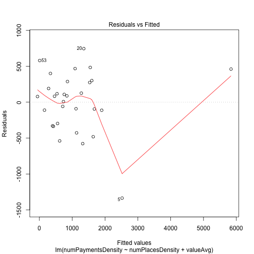  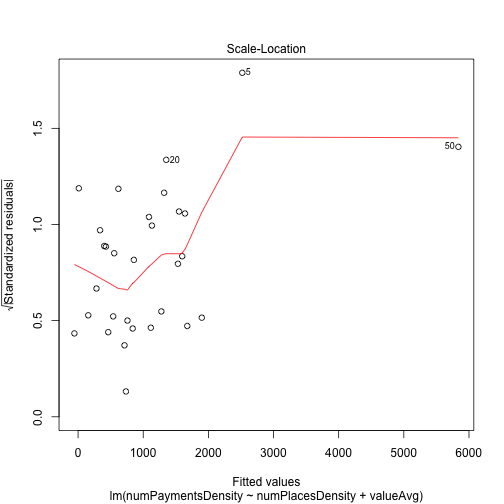 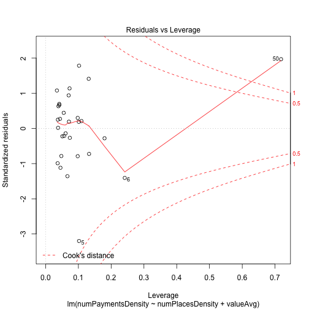 


Predicción de la densidad de pagos según una combinación de densidad de locales (100) y valoración de los mismos (4) 
------------------------------------------------

```r
# Prediction using predict function
predict(model_bcn, list(numPlacesDensity=100, valueAvg=4))
```

```
##     1 
## 519.3
```


Diagnóstico de la regresión
----------------------------------

```r
# Regression Diagnostics
calc.relimp(model_bcn,type=c("lmg","last","first","pratt"),rela=TRUE)
```

```
## Response variable: numPaymentsDensity 
## Total response variance: 1349432 
## Analysis based on 30 observations 
## 
## 2 Regressors: 
## numPlacesDensity valueAvg 
## Proportion of variance explained by model: 86.61%
## Metrics are normalized to sum to 100% (rela=TRUE). 
## 
## Relative importance metrics: 
## 
##                      lmg    last   first   pratt
## numPlacesDensity 0.95167 0.97258 0.93253 0.95679
## valueAvg         0.04833 0.02742 0.06747 0.04321
## 
## Average coefficients for different model sizes: 
## 
##                        1X      2Xs
## numPlacesDensity    5.091    5.003
## valueAvg         2625.727 1610.391
```


Cálculo de los valores estimados de densidad de pagos aplicando la ecuación del modelo de regresión lineal múltiple
------------------------------------------


```r
# Function to calculate estimated values of sample data
places_density <- bcn_value[4]
value_avg <- bcn_value[5]
payments_density <- bcn_value[13]
input_df <- cbind(places_density,value_avg,payments_density)
```

**Función para aplicar la ecuación de regresión**

```r
foo <- function(x,x1){
  estimated <- -6422.530 + (x*5.003) + (x1*1610.391)
  estimated
}
estimated_payments <- mapply(foo,input_df$numPlacesDensity,input_df$valueAvg)
```

**Inclusión de los estimados calculados con la ecuación del modelo**

```r
# Adding estimated payments
df <- cbind(input_df,estimated_payments)
head(df)
```

```
##   numPlacesDensity valueAvg numPaymentsDensity estimated_payments
## 2            366.5    3.891            1580.28            1676.13
## 3            122.5    3.705              44.95             156.10
## 5            529.5    3.909            1185.19            2520.96
## 6            229.7    3.659              79.74             619.04
## 8            249.4    4.034             743.26            1320.84
## 9             49.3    3.800              22.11             -56.38
```

```r
plot(df$numPaymentsDensity,df$estimated_payments)
```

 


Análisis de los diferentes sectores económicos que aparecen en los datos de origen
----------------------------------------------------------

```r
# Analyzing the regression model for different sectors - fashion, food, hotel
#  Filtering data with a minimum valued places
bcn_value <- bcn_data[bcn_data$valuedPlaces>20,]
str(bcn_value)
```

```
## 'data.frame':	30 obs. of  15 variables:
##  $ postalCode         : int  8001 8001 8002 8002 8003 8003 8004 8005 8006 8007 ...
##  $ category           : Factor w/ 3 levels "fashion","food",..: 2 3 2 3 2 3 2 2 2 2 ...
##  $ numPlaces          : int  350 117 378 164 430 85 162 216 200 185 ...
##  $ numPlacesDensity   : num  366 122 529 230 249 ...
##  $ valueAvg           : num  3.89 3.7 3.91 3.66 4.03 ...
##  $ valuedPlaces       : int  127 44 149 56 194 24 37 48 39 88 ...
##  $ valuedPlacesPercent: num  36.3 37.6 39.4 34.1 45.1 ...
##  $ lat                : num  41.4 41.4 41.4 41.4 41.4 ...
##  $ long               : num  2.17 2.17 2.18 2.18 2.19 ...
##  $ geometry           : Factor w/ 42 levels "{\"type\": \"Polygon\", \"coordinates\": [[[2.0735744170000898, 41.417463828000095], [2.0752086290000897, 41.415986417000099], "| __truncated__,..: 20 20 26 26 35 35 21 39 11 23 ...
##  $ area               : num  0.955 0.955 0.714 0.714 1.724 ...
##  $ numPayments        : num  1509.3 42.9 846.1 56.9 1281.4 ...
##  $ numPaymentsDensity : num  1580.3 44.9 1185.2 79.7 743.3 ...
##  $ numPaymentsPerPlace: num  4.312 0.367 2.238 0.347 2.98 ...
##  $ numCards           : num  1267.9 41 757.1 52.7 1079.6 ...
```


Food
-------------------------------------

```r
# Filtering food
food_data <- subset(bcn_value,category=="food")
dim(food_data)
```

```
## [1] 25 15
```

```r
# Regression model for food
model_bcn_food <- lm(numPaymentsDensity ~ numPlacesDensity + valueAvg,data=food_data)
summary(model_bcn_food)
```

```
## 
## Call:
## lm(formula = numPaymentsDensity ~ numPlacesDensity + valueAvg, 
##     data = food_data)
## 
## Residuals:
##     Min      1Q  Median      3Q     Max 
## -1435.1  -141.8    73.4   259.3   573.5 
## 
## Coefficients:
##                  Estimate Std. Error t value Pr(>|t|)    
## (Intercept)        45.792   4321.847    0.01     0.99    
## numPlacesDensity    4.890      0.402   12.15  3.1e-11 ***
## valueAvg           -3.701   1090.139    0.00     1.00    
## ---
## Signif. codes:  0 '***' 0.001 '**' 0.01 '*' 0.05 '.' 0.1 ' ' 1 
## 
## Residual standard error: 438 on 22 degrees of freedom
## Multiple R-squared: 0.871,	Adjusted R-squared: 0.859 
## F-statistic:   74 on 2 and 22 DF,  p-value: 1.7e-10
```

```r
model_bcn_food
```

```
## 
## Call:
## lm(formula = numPaymentsDensity ~ numPlacesDensity + valueAvg, 
##     data = food_data)
## 
## Coefficients:
##      (Intercept)  numPlacesDensity          valueAvg  
##            45.79              4.89             -3.70
```

```r
# four plots, including normal probability plot, of residuals
plot(model_bcn_food)
```

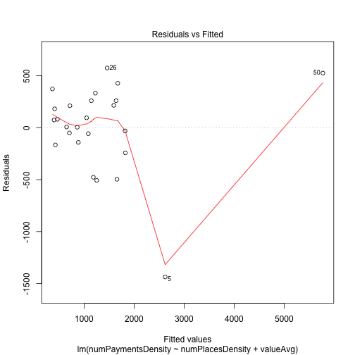  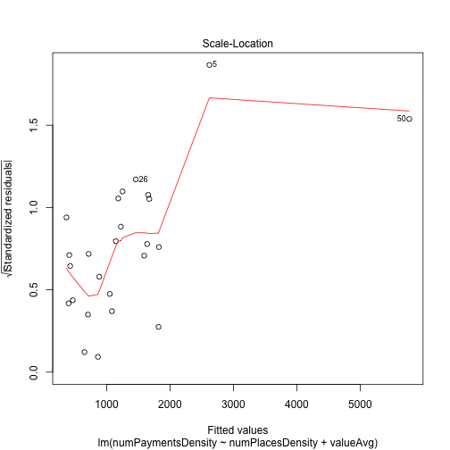 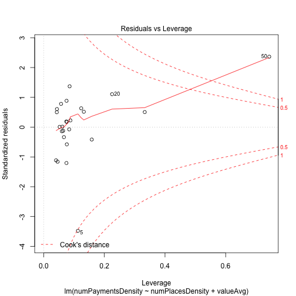 

**En este caso, el modelo de regresión aplicado a los datos de todos los sectores si tiene una correspondencia con los resultados de aquellas entradas que pertenecen a la categoría "food"**

Fashion
--------------------------------------
**En el caso de los resultados de la categoría "fashion", vamos a usar un umbral mínimo de locales valorados de 3**

```r
# Filtering fashion

fashion_data <- bcn_data[bcn_data$valuedPlaces>=3 & bcn_data$category=="fashion" ,]
```


```r
# Fashion model
model_bcn_fashion <- lm(numPaymentsDensity ~ numPlacesDensity + valueAvg,data=fashion_data)
summary(model_bcn_fashion)
```

```
## 
## Call:
## lm(formula = numPaymentsDensity ~ numPlacesDensity + valueAvg, 
##     data = fashion_data)
## 
## Residuals:
##      4     19     22     34     46     55     85    100 
##  510.0  525.3 -317.6 -694.7  -25.3  305.9 -195.3 -108.3 
## 
## Coefficients:
##                  Estimate Std. Error t value Pr(>|t|)  
## (Intercept)      -1549.32    2988.00   -0.52    0.626  
## numPlacesDensity     4.30       1.29    3.32    0.021 *
## valueAvg           376.86     726.09    0.52    0.626  
## ---
## Signif. codes:  0 '***' 0.001 '**' 0.01 '*' 0.05 '.' 0.1 ' ' 1 
## 
## Residual standard error: 503 on 5 degrees of freedom
## Multiple R-squared: 0.707,	Adjusted R-squared: 0.589 
## F-statistic: 6.02 on 2 and 5 DF,  p-value: 0.0467
```

```r
model_bcn_fashion
```

```
## 
## Call:
## lm(formula = numPaymentsDensity ~ numPlacesDensity + valueAvg, 
##     data = fashion_data)
## 
## Coefficients:
##      (Intercept)  numPlacesDensity          valueAvg  
##          -1549.3               4.3             376.9
```

```r
plot(model_bcn_fashion)
```

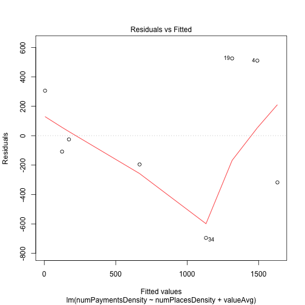  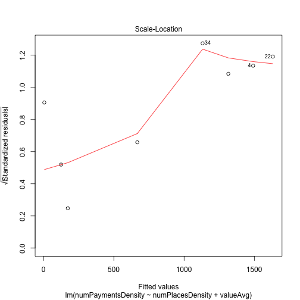 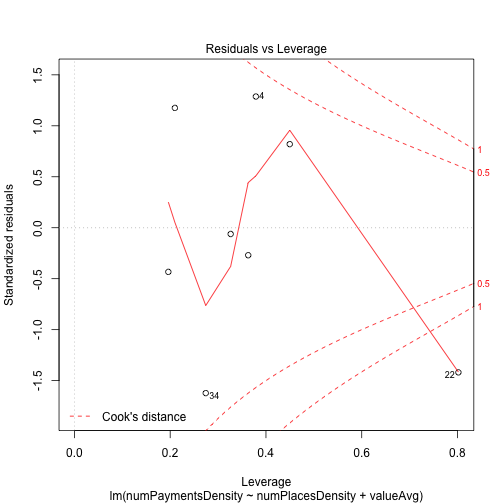 


Hotel
-----------------------------------
**En el caso de los resultados de la categoría "hotel", vamos a usar un umbral mínimo de locales valorados de 5**

```r
# Filtering hotel
hotel_data <- bcn_data[bcn_data$valuedPlaces>=5 & bcn_data$category=="hotel" ,]
# Hotel model
model_bcn_hotel <- lm(numPaymentsDensity ~ numPlacesDensity + valueAvg,data=hotel_data)
summary(model_bcn_hotel)
```

```
## 
## Call:
## lm(formula = numPaymentsDensity ~ numPlacesDensity + valueAvg, 
##     data = hotel_data)
## 
## Residuals:
##    Min     1Q Median     3Q    Max 
## -15.72  -7.62  -4.28   3.96  36.36 
## 
## Coefficients:
##                  Estimate Std. Error t value Pr(>|t|)    
## (Intercept)      -12.0095    69.1764   -0.17     0.86    
## numPlacesDensity   0.3760     0.0542    6.94  1.3e-06 ***
## valueAvg           5.7658    17.4169    0.33     0.74    
## ---
## Signif. codes:  0 '***' 0.001 '**' 0.01 '*' 0.05 '.' 0.1 ' ' 1 
## 
## Residual standard error: 13.8 on 19 degrees of freedom
## Multiple R-squared: 0.728,	Adjusted R-squared:  0.7 
## F-statistic: 25.5 on 2 and 19 DF,  p-value: 4.22e-06
```

```r
model_bcn_hotel
```

```
## 
## Call:
## lm(formula = numPaymentsDensity ~ numPlacesDensity + valueAvg, 
##     data = hotel_data)
## 
## Coefficients:
##      (Intercept)  numPlacesDensity          valueAvg  
##          -12.009             0.376             5.766
```

```r
plot(model_bcn_hotel)
```

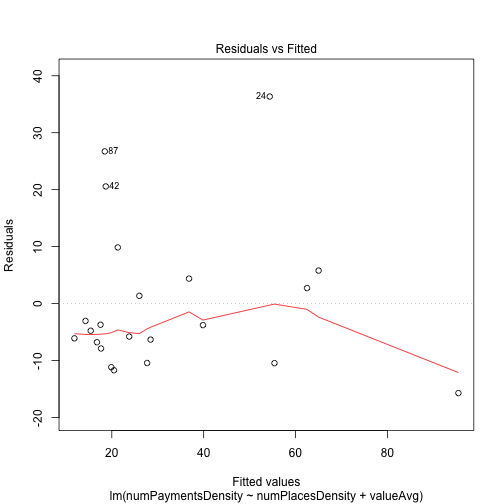  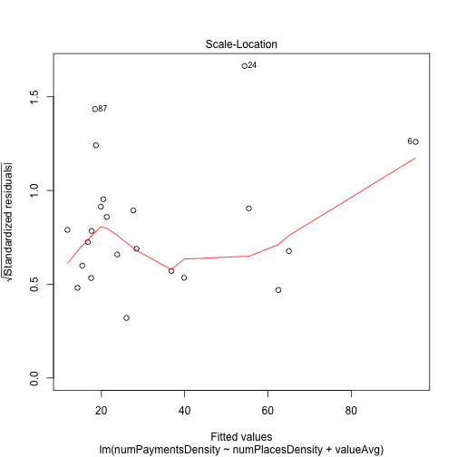 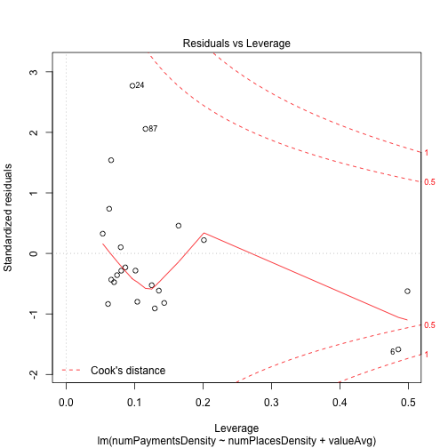 

