 Modelo de predicción de densidad de pagos con tarjetas bancarias en función de la densidad de establecimientos y su valoración en google places (Madrid) 
========================================================

Introducción y planteamiento teórico
---------------------------------------
**El objetivo de este análisis es construir un modelo de predicción que nos permita evaluar si es posible predecir los pagos con tarjetas bancarias en función del número de locales comerciales y su éxito social medido en valoraciones de usuarios en Google Places. Para ello, vamos a tomar como referencia los datos facilitados por el BBVA en su API del datathon Innova data 2013 y los datos facilitados por la API de Google Places.**

Hipótesis de trabajo
---------------------------------------
**1. Pensamos que la densidad de pagos con tarjetas bancarias se puede relacionar y en parte explicar en función de la densidad de locales comerciales.**  
**2. Consideramos que la densidad de locales comerciales en una localización geográfica influye a la hora de decidir la apertura de un nuevo local.**  
**3. Nos preguntamos si la valoración en Internet de los usuarios sobre los locales comerciales está relacionada con el nivel de gasto por pagos con tarjetas bancarias.**

Carga de paquetes necesarios para el análisis
----------------------------------------------

```r
library(car)
```

```
## Loading required package: MASS
## Loading required package: nnet
```

```r
library(gvlma)
library(relaimpo)
```

```
## Loading required package: boot
## 
## Attaching package: 'boot'
## 
## The following object(s) are masked from 'package:car':
## 
##     logit
## 
## Loading required package: survey
## 
## Attaching package: 'survey'
## 
## The following object(s) are masked from 'package:graphics':
## 
##     dotchart
## 
## Loading required package: mitools
## Loading required package: foreign
## Loading required package: corpcor
```

```
## This is the global version of package relaimpo. 
## If you are a non-US user, a version with the interesting additional metric pmvd is available 
## from Ulrike Groempings web site at http://prof.beuth-hochschule.de/groemping/relaimpo.
```

```r
library(visreg)
```

```
## Loading required package: lattice
## 
## Attaching package: 'lattice'
## 
## The following object(s) are masked from 'package:boot':
## 
##     melanoma
```


Lectura del fichero base consolidado con datos BBVA + Google Places
-------------------------------------------------------------------

```r
# Load data
mad_data <- read.csv("http://www.ekonlab.com/innova_bbva/data/madMergedExpanded.csv")
```


Primera visión sobre el conjunto de datos
-------------------------------------------


```r
# First overview
str(mad_data)
```

```
## 'data.frame':	165 obs. of  15 variables:
##  $ postalCode         : int  28001 28001 28001 28002 28002 28002 28003 28003 28003 28004 ...
##  $ category           : Factor w/ 3 levels "fashion","food",..: 1 2 3 1 2 3 1 2 3 1 ...
##  $ lat                : num  40.4 40.4 40.4 40.4 40.4 ...
##  $ long               : num  -3.68 -3.68 -3.68 -3.67 -3.67 ...
##  $ geometry           : Factor w/ 55 levels "{\"type\": \"Polygon\", \"coordinates\": [[[-3.5186399043927614, 40.41173465900863], [-3.517967905608741, 40.410634041073649], "| __truncated__,..: 27 27 27 19 19 19 40 40 40 35 ...
##  $ area               : num  1.09 1.09 1.09 2.67 2.67 ...
##  $ numPayments        : num  2853 2585 116 269 1944 ...
##  $ numPaymentsPerPlace: num  5.42 10.82 2.47 1.39 6.23 ...
##  $ numPaymentsDensity : num  2621 2375 107 101 729 ...
##  $ numCards           : num  2292 2181 108 246 1489 ...
##  $ numPlaces          : int  526 239 47 194 312 19 143 234 36 434 ...
##  $ numPlacesDensity   : num  483.2 219.6 43.2 72.8 117 ...
##  $ valueAvg           : num  4.09 3.93 3.91 3.84 3.9 ...
##  $ valuedPlaces       : int  35 93 7 7 64 3 7 88 6 28 ...
##  $ valuedPlacesPercent: num  6.65 38.91 14.89 3.61 20.51 ...
```


Coeficiente de correlación entre densidad de pagos y densidad de locales comerciales y valoración de dichos locales comerciales
-------------------------------------------------------

```r
# Correlation between numPaymentsDensity and numPlacesDensity
cor.test(mad_data$numPaymentsDensity,mad_data$numPlacesDensity)
```

```
## 
## 	Pearson's product-moment correlation
## 
## data:  mad_data$numPaymentsDensity and mad_data$numPlacesDensity 
## t = 18.41, df = 163, p-value < 2.2e-16
## alternative hypothesis: true correlation is not equal to 0 
## 95 percent confidence interval:
##  0.7650 0.8658 
## sample estimates:
##    cor 
## 0.8217
```

```r
# Correlation between numPaymentsDensity and valueAvg
cor.test(mad_data$numPaymentsDensity,mad_data$valueAvg)
```

```
## 
## 	Pearson's product-moment correlation
## 
## data:  mad_data$numPaymentsDensity and mad_data$valueAvg 
## t = -0.1962, df = 136, p-value = 0.8448
## alternative hypothesis: true correlation is not equal to 0 
## 95 percent confidence interval:
##  -0.1834  0.1507 
## sample estimates:
##      cor 
## -0.01682
```

**Tal y como se puede apreciar en los resultados, existe una fuerte correlación (0.82) entre la densidad de pagos con tarjetas y la densidad de locales comerciales obtenida mediante Google Places. Sin embargo, el coeficiente de correlación entre la densidad de pagos con tarjetas y la valoración de los locales comerciales es manifiestamente más baja (-0.01).**

Filtrado de datos a modelar en función de un número mínimo de locales evaluados
--------------------------------------------------------------------

```r
# Multiple linear regression: numPaymentsDensity as per numPlacesDensity + valueAvg
# Filtering data with a minimum valued places
madrid_value <- mad_data[mad_data$valuedPlaces>40,]
```

**Tras haber realizado diversas pruebas de cálculo, hemos establecido un umbral mínimo de datos cuyos locales han sido evaluados por usuarios. Esta umbral mínimo ha sido establecido en 40**


Planteamiento de un modelo de regresión lineal múltiple. Densidad de pagos en función de densidad de locales y valoración de los mismos
--------------------------------------------------------

```r
# Regression model
model_mad <- lm(numPaymentsDensity ~ numPlacesDensity + valueAvg,data=madrid_value)
summary(model_mad)
```

```
## 
## Call:
## lm(formula = numPaymentsDensity ~ numPlacesDensity + valueAvg, 
##     data = madrid_value)
## 
## Residuals:
##    Min     1Q Median     3Q    Max 
##  -1014   -307    121    275    723 
## 
## Coefficients:
##                   Estimate Std. Error t value Pr(>|t|)    
## (Intercept)      -2.88e+04   1.05e+04   -2.74  0.01291 *  
## numPlacesDensity  3.45e+00   7.94e-01    4.34  0.00035 ***
## valueAvg          7.55e+03   2.71e+03    2.78  0.01193 *  
## ---
## Signif. codes:  0 '***' 0.001 '**' 0.01 '*' 0.05 '.' 0.1 ' ' 1 
## 
## Residual standard error: 480 on 19 degrees of freedom
## Multiple R-squared: 0.609,	Adjusted R-squared: 0.568 
## F-statistic: 14.8 on 2 and 19 DF,  p-value: 0.000132
```

```r
model_mad
```

```
## 
## Call:
## lm(formula = numPaymentsDensity ~ numPlacesDensity + valueAvg, 
##     data = madrid_value)
## 
## Coefficients:
##      (Intercept)  numPlacesDensity          valueAvg  
##        -28756.56              3.45           7546.73
```

**Tal y como se puede apreciar en los resultados del modelo, podemos explicar la densidad de pagos en buena parte (56,83%) gracias a la información de la densidad de locales y en menor medida, gracias a la información de las valoraciones de los locales**


```r
# four plots, including normal probability plot, of residuals
plot(model_mad)
```

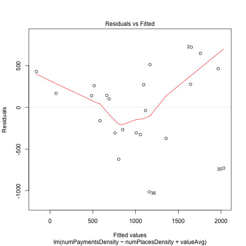  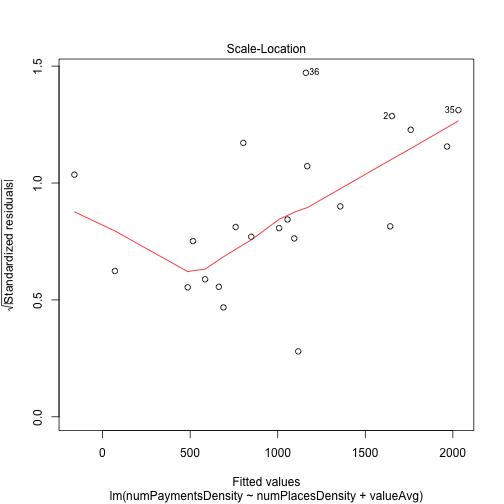 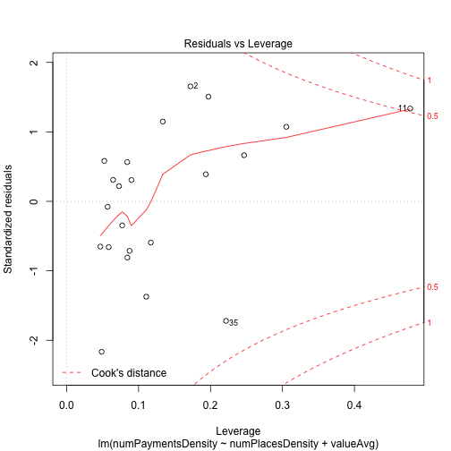 


Predicción de la densidad de pagos según una combinación de densidad de locales (100) y valoración de los mismos (4) 
------------------------------------------------

```r
# Prediction using predict function
predict(model_mad, list(numPlacesDensity=100, valueAvg=4))
```

```
##    1 
## 1775
```


Diagnóstico de la regresión
----------------------------------

```r
# Regression Diagnostics
calc.relimp(model_mad,type=c("lmg","last","first","pratt"),rela=TRUE)
```

```
## Response variable: numPaymentsDensity 
## Total response variance: 533599 
## Analysis based on 22 observations 
## 
## 2 Regressors: 
## numPlacesDensity valueAvg 
## Proportion of variance explained by model: 60.94%
## Metrics are normalized to sum to 100% (rela=TRUE). 
## 
## Relative importance metrics: 
## 
##                     lmg   last  first  pratt
## numPlacesDensity 0.6878 0.7093 0.6703 0.6901
## valueAvg         0.3122 0.2907 0.3297 0.3099
## 
## Average coefficients for different model sizes: 
## 
##                        1X     2Xs
## numPlacesDensity    3.695    3.45
## valueAvg         8857.881 7546.73
```


Cálculo de los valores estimados de densidad de pagos aplicando la ecuación del modelo de regresión lineal múltiple
------------------------------------------


```r
# Function to calculate estimated values of sample data
places_density <- madrid_value[12]
value_avg <- madrid_value[13]
payments_density <- madrid_value[9]
input_df <- cbind(places_density,value_avg,payments_density)
```

**Función para aplicar la ecuación de regresión**

```r
foo <- function(x,x1){
  estimated <- -28756.56 + (x*3.45) + (x1*7456.73)
  estimated
}
estimated_payments <- mapply(foo,input_df$numPlacesDensity,input_df$valueAvg)
```

**Inclusión de los estimados calculados con la ecuación del modelo**

```r
# Adding estimated payments
df <- cbind(input_df,estimated_payments)
head(df)
```

```
##    numPlacesDensity valueAvg numPaymentsDensity estimated_payments
## 2             219.6    3.929             2374.9             1298.6
## 5             117.0    3.897              729.2              705.1
## 8             113.4    3.847              807.2              317.6
## 11            532.4    3.828             2430.6             1622.4
## 14            182.7    3.861              702.6              660.4
## 17            164.0    3.880             1366.1              744.9
```

```r
plot(df$numPaymentsDensity,df$estimated_payments)
```

 


Análisis de los diferentes sectores económicos que aparecen en los datos de origen
----------------------------------------------------------

```r
# Analyzing the regression model for different sectors - fashion, food, hotel
#  Filtering data with a minimum valued places
madrid_value <- mad_data[mad_data$valuedPlaces>40,]
str(madrid_value)
```

```
## 'data.frame':	22 obs. of  15 variables:
##  $ postalCode         : int  28001 28002 28003 28004 28005 28006 28008 28009 28010 28012 ...
##  $ category           : Factor w/ 3 levels "fashion","food",..: 2 2 2 2 2 2 2 2 2 2 ...
##  $ lat                : num  40.4 40.4 40.4 40.4 40.4 ...
##  $ long               : num  -3.68 -3.67 -3.7 -3.7 -3.71 ...
##  $ geometry           : Factor w/ 55 levels "{\"type\": \"Polygon\", \"coordinates\": [[[-3.5186399043927614, 40.41173465900863], [-3.517967905608741, 40.410634041073649], "| __truncated__,..: 27 19 40 35 43 28 47 23 36 37 ...
##  $ area               : num  1.09 2.67 2.06 1.24 2.99 ...
##  $ numPayments        : num  2585 1944 1666 3004 2100 ...
##  $ numPaymentsPerPlace: num  10.82 6.23 7.12 4.57 3.85 ...
##  $ numPaymentsDensity : num  2375 729 807 2431 703 ...
##  $ numCards           : num  2181 1489 1387 2482 1695 ...
##  $ numPlaces          : int  239 312 234 658 546 305 238 347 270 515 ...
##  $ numPlacesDensity   : num  220 117 113 532 183 ...
##  $ valueAvg           : num  3.93 3.9 3.85 3.83 3.86 ...
##  $ valuedPlaces       : int  93 64 88 303 200 82 99 104 93 249 ...
##  $ valuedPlacesPercent: num  38.9 20.5 37.6 46 36.6 ...
```


Food
-------------------------------------

```r
# Filtering food
food_data <- subset(madrid_value,category=="food")
dim(food_data)
```

```
## [1] 20 15
```

```r
# Regression model for food
model_mad_food <- lm(numPaymentsDensity ~ numPlacesDensity + valueAvg,data=food_data)
summary(model_mad_food)
```

```
## 
## Call:
## lm(formula = numPaymentsDensity ~ numPlacesDensity + valueAvg, 
##     data = food_data)
## 
## Residuals:
##    Min     1Q Median     3Q    Max 
## -840.2 -323.4   57.7  264.4  683.1 
## 
## Coefficients:
##                   Estimate Std. Error t value Pr(>|t|)    
## (Intercept)      -2.55e+04   9.18e+03   -2.78    0.013 *  
## numPlacesDensity  3.63e+00   6.75e-01    5.37  5.1e-05 ***
## valueAvg          6.71e+03   2.38e+03    2.83    0.012 *  
## ---
## Signif. codes:  0 '***' 0.001 '**' 0.01 '*' 0.05 '.' 0.1 ' ' 1 
## 
## Residual standard error: 406 on 17 degrees of freedom
## Multiple R-squared: 0.709,	Adjusted R-squared: 0.675 
## F-statistic: 20.7 on 2 and 17 DF,  p-value: 2.78e-05
```

```r
model_mad_food
```

```
## 
## Call:
## lm(formula = numPaymentsDensity ~ numPlacesDensity + valueAvg, 
##     data = food_data)
## 
## Coefficients:
##      (Intercept)  numPlacesDensity          valueAvg  
##        -25478.31              3.63           6712.64
```

```r
# four plots, including normal probability plot, of residuals
plot(model_mad_food)
```

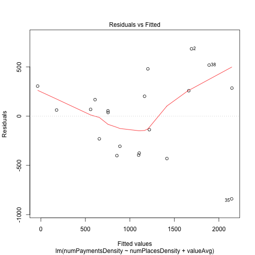  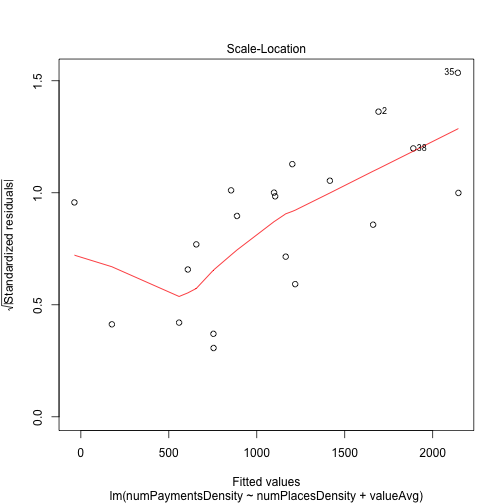 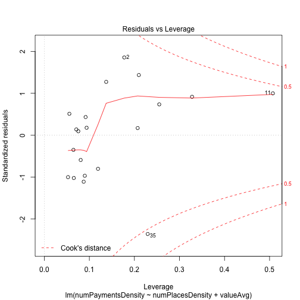 

**En este caso, el modelo de regresión aplicado a los datos de todos los sectores si tiene una correspondencia con los resultados de aquellas entradas que pertenecen a la categoría "food"**

Fashion
--------------------------------------
**En el caso de los resultados de la categoría "fashion", vamos a usar un umbral mínimo de locales valorados de 5**

```r
# Filtering fashion
fashion_data <- mad_data[mad_data$valuedPlaces>=5 & mad_data$category=="fashion" ,]
```


```r
# Fashion model
model_mad_fashion <- lm(numPaymentsDensity ~ numPlacesDensity + valueAvg,data=fashion_data)
summary(model_mad_fashion)
```

```
## 
## Call:
## lm(formula = numPaymentsDensity ~ numPlacesDensity + valueAvg, 
##     data = fashion_data)
## 
## Residuals:
##    Min     1Q Median     3Q    Max 
## -856.6 -259.9 -164.9   55.8 2166.6 
## 
## Coefficients:
##                  Estimate Std. Error t value Pr(>|t|)   
## (Intercept)       -424.76    3920.83   -0.11   0.9157   
## numPlacesDensity     5.29       1.64    3.22   0.0082 **
## valueAvg           104.32    1033.44    0.10   0.9214   
## ---
## Signif. codes:  0 '***' 0.001 '**' 0.01 '*' 0.05 '.' 0.1 ' ' 1 
## 
## Residual standard error: 748 on 11 degrees of freedom
## Multiple R-squared: 0.527,	Adjusted R-squared: 0.441 
## F-statistic: 6.13 on 2 and 11 DF,  p-value: 0.0162
```

```r
model_mad_fashion
```

```
## 
## Call:
## lm(formula = numPaymentsDensity ~ numPlacesDensity + valueAvg, 
##     data = fashion_data)
## 
## Coefficients:
##      (Intercept)  numPlacesDensity          valueAvg  
##          -424.76              5.29            104.32
```

```r
plot(model_mad_fashion)
```

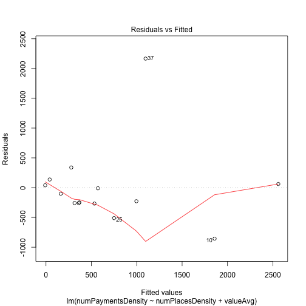 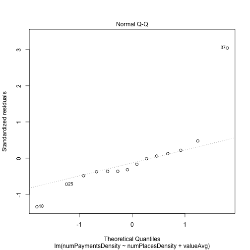 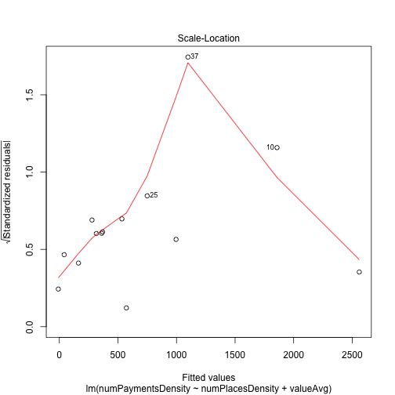 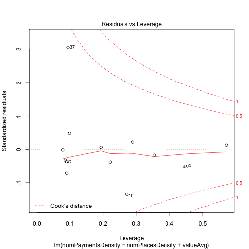 


Hotel
-----------------------------------
**En el caso de los resultados de la categoría "hotel", vamos a usar un umbral mínimo de locales valorados de 5**

```r
# Filtering hotel
hotel_data <- mad_data[mad_data$valuedPlaces>=5 & mad_data$category=="hotel" ,]
# Hotel model
model_mad_hotel <- lm(numPaymentsDensity ~ numPlacesDensity + valueAvg,data=hotel_data)
summary(model_mad_hotel)
```

```
## 
## Call:
## lm(formula = numPaymentsDensity ~ numPlacesDensity + valueAvg, 
##     data = hotel_data)
## 
## Residuals:
##    Min     1Q Median     3Q    Max 
## -23.63  -9.13  -5.41   1.72  59.01 
## 
## Coefficients:
##                   Estimate Std. Error t value Pr(>|t|)    
## (Intercept)      -116.1736   125.6723   -0.92     0.37    
## numPlacesDensity    0.7986     0.0811    9.84  6.8e-09 ***
## valueAvg           33.0309    32.3652    1.02     0.32    
## ---
## Signif. codes:  0 '***' 0.001 '**' 0.01 '*' 0.05 '.' 0.1 ' ' 1 
## 
## Residual standard error: 21.2 on 19 degrees of freedom
## Multiple R-squared: 0.837,	Adjusted R-squared: 0.819 
## F-statistic: 48.6 on 2 and 19 DF,  p-value: 3.36e-08
```

```r
model_mad_hotel
```

```
## 
## Call:
## lm(formula = numPaymentsDensity ~ numPlacesDensity + valueAvg, 
##     data = hotel_data)
## 
## Coefficients:
##      (Intercept)  numPlacesDensity          valueAvg  
##         -116.174             0.799            33.031
```

```r
plot(model_mad_hotel)
```

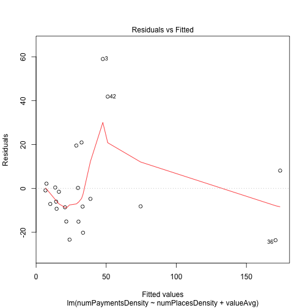 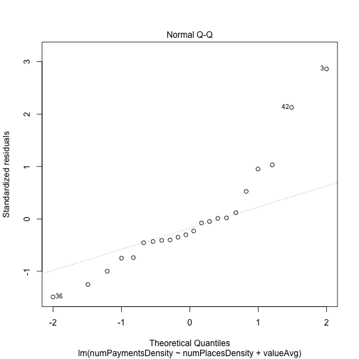 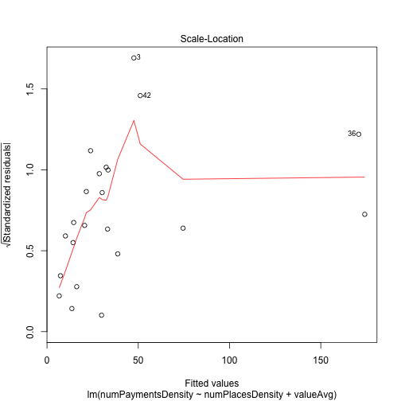 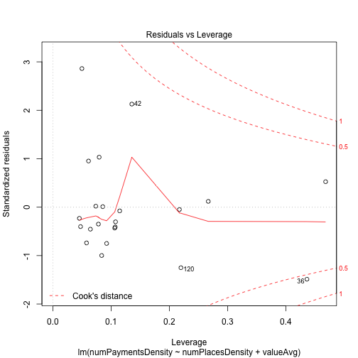 


